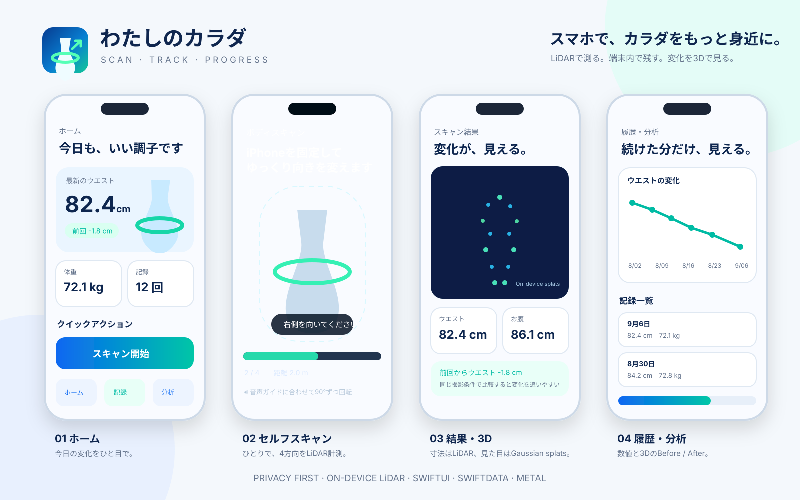

# わたしのカラダ — On-device LiDAR Body Progress Tracker

> メジャーや第三者撮影に頼らず、iPhone LiDARで「体の変化」をできるだけ同じ条件で記録するための、ダイエット / 筋トレ向けセルフ記録アプリ。

  

## 目的

このアプリは「医療計測器」ではなく、**自分の体型変化を同じ撮影条件で継続記録するためのツール**です。iPhoneを固定し、自分で正面・右・背面・左の4方向を向くだけで計測できることを最優先にしています。

## MVPでできること

- iPhoneを固定し、**正面 → 右 → 背面 → 左**を音声ガイドでセルフスキャン
- ARKit `sceneDepth` / `smoothedSceneDepth` を使ったオンデバイス深度取得
- LiDARのメートル単位depthとcamera intrinsicsから人体表面点を復元
- confidence filter + 中央torso seed + connected componentで人体候補を分離
- ウエスト / お腹 / ヒップの断面を4方向silhouetteから推定
- 正面/背面と左右側面をquality-weightedで統合し、楕円断面の周長を算出
- 各LiDAR点をmetric 3D mean + metric sigmaとして保持し、MetalでGaussian splat表示
- SwiftDataで計測履歴を端末内保存
- Swift Chartsでウエスト推移を表示
- 手入力の体重 / ウエスト / メモも同じ履歴に記録
- スキャンJSONはApplication Support以下にファイル保護付きで保存
- v0.1.0ではクラウド送信なし

## UIデザイン

- [UI design board](Docs/ui-concept.svg)
- [App icon concept](Docs/app-icon-first-image.jpg)
- iPhone / App Store用AppIconは `WatashiNoKarada/Resources/Assets.xcassets/AppIcon.appiconset/` に収録

## 3D Gaussian Splattingについて — 技術的に重要

現行MVPは、**LiDAR depthで初期化した isotropic Gaussian splat surface preview**です。

各splatは次を持ちます。

- LiDAR由来のmetric XYZ mean
- depth pixel footprintから求めたmetric sigma
- RGBA tint

Metal shaderではmetric sigmaをview depthに応じてscreen-spaceへ投影し、Gaussian alpha falloffで描画します。

ただし、これはKerbl et al.のオリジナル3D Gaussian Splattingを完全実装したphotorealistic radiance fieldではありません。現時点では以下を行っていません。

- multi-view RGBからのdifferentiable training
- anisotropic 3D covariance optimization
- learned opacity / densification / pruning
- Spherical Harmonicsによるview-dependent appearance
- full visibility-aware sorted alpha compositing

したがって、READMEやアプリでは**「フル3DGS実装済み」とは表現しません**。3D表示はLiDAR geometryの高速オンデバイス可視化です。寸法計測のsource of truthは3D表示ではなく、常にARKit LiDARのmetric depthです。

この構成を選ぶ理由は、固定iPhoneに対して人体が回転・変形するため、通常の「静止scene + moving camera」を仮定した写真ベース3DGSをそのまま適用すると幾何整合性が崩れやすいからです。

## 測定アルゴリズム

1. `smoothedSceneDepth`（利用不可なら`sceneDepth`）を取得
2. depthと`confidenceMap`をportrait座標へ正規化
3. 画面中央torso領域のrobust median depthを基準距離として推定
4. その距離帯にあるmedium/high-confidence depthだけを候補mask化
5. 画面中央に最も近いseedから8-connected componentを抽出し、同じ距離の壁や家具を除外
6. 各測定bandで、torso中心に最も近い**連続silhouette run**だけを使って横幅を算出
7. 正面+背面を左右径、右+左を前後径としてquality-weighted平均
8. 楕円断面を仮定し、Ramanujan第2近似で周長を計算
9. 3D記録用点群は各poseの重心を合わせ、既知の0/90/180/270° yawでcanonicalize

### 現時点の精度上の限界

測定bandの高さはまだ人体landmarkではなくsilhouette比率ベースです。また人体断面は完全な楕円ではなく、4方向の点群もICP/non-rigid registration済みではありません。そのため、**絶対値を医療・診断目的で使う設計ではありません**。

このMVPでまず評価するのは、同一条件で5回測ったときのrepeatabilityです。実機結果を見てからVision body pose、landmark-based band、cross-section curve fitting、ICP/non-rigid registrationを追加します。

## 推奨撮影条件

- LiDAR搭載iPhone Pro / Pro Max
- 背面カメラを自分へ向けて固定
- 約1.8〜2.4 m離れる
- 腕を体から少し離す
- 薄手で毎回似た服装
- 普通に息を吐いた状態で姿勢を揃える
- 背景との距離差がある場所で撮る

## 開発環境

- iOS 17+
- SwiftUI
- SwiftData
- ARKit / LiDAR Scene Depth
- Metal / MetalKit
- Swift Charts
- AVFoundation（日本語音声ガイド）

## 実行

1. `WatashiNoKarada.xcodeproj` をXcodeで開く
2. Signing & Capabilitiesで自分のDevelopment Teamを選ぶ
3. LiDAR搭載の実機を接続する
4. `WatashiNoKarada` schemeをRun
5. カメラ権限を許可して「スキャン」から開始

SimulatorではLiDAR計測は動きません。

## Docs

- [Architecture](Docs/ARCHITECTURE.md)
- [Technical review](Docs/TECHNICAL_REVIEW.md)
- [First-device test plan](Docs/TEST_PLAN.md)

## Privacy

v0.1.0ではネットワークAPIを使用しません。深度・寸法・3D記録はアプリのsandbox内に保存します。

## Roadmap

- Vision 2D/3D body poseによる測定bandのlandmark補正
- 同一pose内で複数depth frameをmedian統合
- 4-view ICP / non-rigid registration
- 3D cross-section curve fitting（楕円仮定からの脱却）
- anisotropic covariance / opacity / RGBを含むadvanced Gaussian splatting
- Before / After 3D差分heatmap
- Apple Watchからスキャン開始・触覚ガイド
- HealthKit（体重）の任意連携
- 撮影条件の再現性スコア

## Author

Created and maintained by **SYUN (@syun88)**.

## References

- Apple — ARKit: Displaying a point cloud using scene depth  
  https://developer.apple.com/documentation/arkit/displaying-a-point-cloud-using-scene-depth
- Kerbl et al. — 3D Gaussian Splatting for Real-Time Radiance Field Rendering  
  https://arxiv.org/abs/2308.04079

## License

MIT
